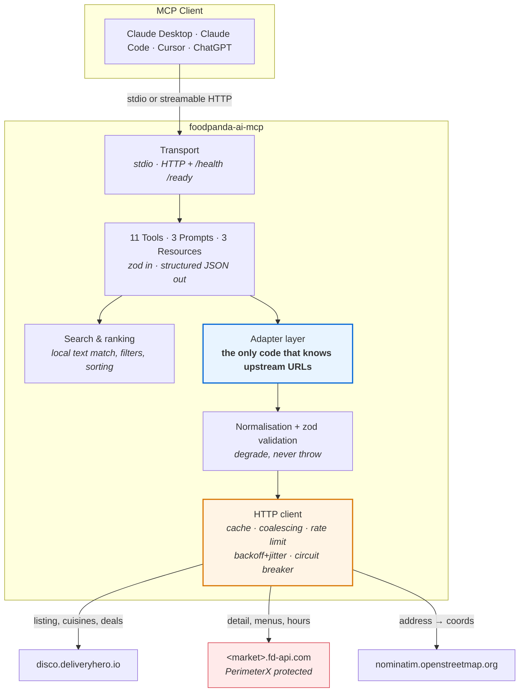

<div align="center">

# 🐼 foodpanda-ai-mcp

**Ask your AI assistant what's good to eat near you — and get real answers, from real menus, at real prices.**

[](https://github.com/RehmTheGreat/foodpanda-ai-mcp/actions/workflows/ci.yml)
[](https://www.npmjs.com/package/foodpanda-ai-mcp)
[](https://nodejs.org)
[](LICENSE)
[](https://modelcontextprotocol.io)
[](tests/)

An [MCP](https://modelcontextprotocol.io) server that gives Claude, ChatGPT, Cursor and any
other MCP client **read-only** access to foodpanda's public restaurant data across **10 countries**.

**No API key. No account. No login. It cannot order food.**

</div>

---

> ### ⚠️ Unofficial project
> Not affiliated with, endorsed by, or connected to **foodpanda** or **Delivery Hero SE**.
> It reads public, unauthenticated endpoints that the foodpanda website itself calls.
> Prices and availability are indicative — **the foodpanda app at checkout is the only authority.**
> See [Legal & ethics](#-legal--ethics).

---

## Contents

- [What you can ask it](#-what-you-can-ask-it)
- [Install](#-install) · [Claude Desktop](#claude-desktop) · [Claude Code](#claude-code) · [Cursor](#cursor) · [ChatGPT & others](#chatgpt--other-mcp-clients)
- [Tools](#-tools)
- [Supported countries](#-supported-countries)
- [How it works](#-how-it-works)
- [Configuration](#-configuration)
- [Self-hosting & deployment](#-self-hosting--deployment)
- [Troubleshooting](#-troubleshooting)
- [Limitations](#-known-limitations-read-this)
- [Development](#-development)
- [Legal & ethics](#-legal--ethics)

---

## 🍽 What you can ask it

These are **real, unedited excerpts** from the live server (Karachi, 2026-07-27).

<details open>
<summary><b>1. “What are the best-rated places delivering to me right now?”</b></summary>

```
> Find the best rated restaurants near Clifton, Karachi

5 of 50 matching restaurants near 24.81442, 67.07164
Scanned 50 of 305 nearby restaurants · sorted by rating

1. Mondo Coffee Bar [Beverages, Tea & Coffee] 🏷
   5.0★ (218) · 2.7 km · ~45 min · fee Rs.99 · min Rs.249
   code: sbhg

2. Cafeela [Shakes, Pasta, Paratha]
   4.9★ (15689) · 1.4 km · ~45 min · fee Rs.99 · min Rs.249
   code: s8ge

3. Quetta Chai [Beverages, Pakistani, Pizza]
   4.9★ (15440) · 3.8 km · ~45 min · fee Rs.99 · min Rs.249
   code: w4bf
```
</details>

<details open>
<summary><b>2. “Find me the cheapest biryani nearby”</b></summary>

```
> What's the cheapest biryani near me?

23 matches for "biryani" across 8 restaurants near Clifton, Karachi
Showing the 5 cheapest by item price + delivery fee:

1. Salad — Rs.80 (was Rs.100) · Rs.179 with delivery
   at Al Naz Biryani Center - Iqra University (p4rc)
   4.6★ · 2.8 km · ~45 min · min Rs.249
   Cucumber and onions for your biryani serving

2. Aloo Biryani — Rs.192 (was Rs.240) · Rs.291 with delivery
   at Al Naz Biryani Center - Iqra University (p4rc)
   4.6★ · 2.8 km · ~45 min · min Rs.249
```

Note it ranks by **item price + delivery fee**, because the cheapest dish and the cheapest
total are often at different restaurants.
</details>

<details open>
<summary><b>3. “Is anything actually open right now?”</b></summary>

```
> Are Mondo, Cafeela and Quetta Chai open?

3 of 3 restaurants are open right now (local time 2026-07-27 11:30 (Asia/Karachi)):

- Mondo Coffee Bar (sbhg): OPEN, closes 23:59
- Cafeela (s8ge): OPEN, closes 23:45
- Quetta Chai (w4bf): OPEN, closes 23:59
```
</details>

<details open>
<summary><b>4. “Compare these three on cost and speed”</b></summary>

```
> Compare them for delivery

Comparing 3 restaurants in pk:

Mondo Coffee Bar [Beverages, Tea & Coffee] 🏷
   5.0★ (218) · 2.7 km · ~5 min · fee Rs.0 · min Rs.249 · OPEN until 23:59
   code: sbhg
   deals: 50% off for your first food order
   ⇒ cheapest delivery, fastest, best rated

Cafeela [Fast Food, Pasta, Pakistani] 🏷
   4.9★ (15689) · 1.4 km · ~10 min · fee Rs.0 · min Rs.149 · OPEN until 23:45
   code: s8ge
   deals: 10% off; 50% off for your first food order
   ⇒ lowest minimum
```
</details>

<details>
<summary><b>5. “What kinds of food can I even get around here?”</b></summary>

```
> What cuisines are available near me?

32 cuisines available near 24.81442, 67.07164 (305 restaurants total):

- Pakistani — 169 restaurants (id 139)
- Beverages — 86 restaurants (id 89)
- Western — 67 restaurants (id 151)
- Desserts — 65 restaurants (id 84)
- Tea & Coffee — 60 restaurants (id 240)
- Biryani — 36 restaurants (id 193)
```
</details>

---

## 📦 Install

**You need [Node.js 20 or newer](https://nodejs.org).** Check with `node --version`.

You do **not** need to clone this repo, install anything globally, or sign up for anything.
`npx` downloads and runs it on demand.

### Claude Desktop

**1. Open the config file.**

| OS | Path |
|---|---|
| **macOS** | `~/Library/Application Support/Claude/claude_desktop_config.json` |
| **Windows** | `%APPDATA%\Claude\claude_desktop_config.json` |
| **Linux** | `~/.config/Claude/claude_desktop_config.json` |

Fastest route: **Claude Desktop → Settings → Developer → Edit Config**.

**2. Paste this in.** If the file is empty, paste the whole thing. If it already has
`mcpServers`, add just the `foodpanda` block inside it.

```json
{
  "mcpServers": {
    "foodpanda": {
      "command": "npx",
      "args": ["-y", "foodpanda-ai-mcp"]
    }
  }
}
```

<details>
<summary>Windows: if <code>npx</code> isn't found</summary>

Windows sometimes cannot resolve `npx` from Claude Desktop. Use `cmd` instead:

```json
{
  "mcpServers": {
    "foodpanda": {
      "command": "cmd",
      "args": ["/c", "npx", "-y", "foodpanda-ai-mcp"]
    }
  }
}
```
</details>

<details>
<summary>Set a default country other than Pakistan</summary>

```json
{
  "mcpServers": {
    "foodpanda": {
      "command": "npx",
      "args": ["-y", "foodpanda-ai-mcp"],
      "env": { "FOODPANDA_DEFAULT_MARKET": "sg" }
    }
  }
}
```
</details>

**3. Fully quit and reopen Claude Desktop.** Closing the window is not enough — quit the app.

**4. Check it worked.** You should see a tools/plug icon in the chat box. Ask:
*"What foodpanda markets do you support?"*

---

### Claude Code

One command:

```bash
claude mcp add foodpanda -- npx -y foodpanda-ai-mcp
```

Then `claude mcp list` to confirm. To make it available in every project:

```bash
claude mcp add --scope user foodpanda -- npx -y foodpanda-ai-mcp
```

---

### Cursor

Create `.cursor/mcp.json` in your project (or `~/.cursor/mcp.json` for all projects):

```json
{
  "mcpServers": {
    "foodpanda": {
      "command": "npx",
      "args": ["-y", "foodpanda-ai-mcp"]
    }
  }
}
```

Then **Cursor → Settings → MCP** and confirm `foodpanda` is listed and green.

---

### ChatGPT & other MCP clients

ChatGPT's connectors and other remote clients need an **HTTP URL**, not a local command.
Run the server in HTTP mode and point the client at `/mcp`.

Locally:

```bash
npx -y foodpanda-ai-mcp --http
# → http://localhost:3000/mcp
```

Then add `http://localhost:3000/mcp` as a custom MCP/connector endpoint. For a public URL,
see [Self-hosting & deployment](#-self-hosting--deployment).

<details>
<summary>Generic stdio config (Zed, Windsurf, Continue, LibreChat, …)</summary>

Almost every client accepts the same command/args pair:

```json
{
  "command": "npx",
  "args": ["-y", "foodpanda-ai-mcp"]
}
```
</details>

<details>
<summary>Run from source instead of npx</summary>

```bash
git clone https://github.com/RehmTheGreat/foodpanda-ai-mcp.git
cd foodpanda-ai-mcp
npm install && npm run build
```

```json
{
  "mcpServers": {
    "foodpanda": {
      "command": "node",
      "args": ["/absolute/path/to/foodpanda-ai-mcp/dist/index.js"]
    }
  }
}
```
Windows paths need escaped backslashes: `"C:\\Users\\you\\foodpanda-ai-mcp\\dist\\index.js"`.
</details>

---

## 🧰 Tools

11 tools. Most accept **either** an `address` **or** `latitude`+`longitude`.

| Tool | What it does | Notes |
|---|---|---|
| `search_restaurants` | The main one. Find restaurants with filters for rating, fee, minimum order, distance, delivery time, discounts, open-now. | Text matching is local; with a filter active it scans the whole area, so results are complete — see [limitations](#-known-limitations-read-this) |
| `get_restaurant` | Full detail: fees (minimum order, small-order fee, delivery, service fee, VAT), ETA, rating, deals and discounts with their numbers, weekly hours, open right now. | Needs `code` + `market` |
| `get_menu` | A restaurant's menu with prices, plus the fees and deals needed to estimate a total. | Menus can be 100s of items — use `maxItems` |
| `search_menu_items` | **Search one dish across many restaurants**, ranked by price. | Slowest tool: opens one menu per restaurant |
| `compare_restaurants` | Side-by-side on fee, minimum, ETA, rating, deals; flags cheapest/fastest/best-rated. | 2–8 restaurants |
| `check_open_now` | Open/closed for up to 10 restaurants, with next opening time. | Uses each market's local timezone |
| `list_cuisines` | Cuisines available near a point, with restaurant counts. | Returns ids for `browse_by_cuisine` |
| `browse_by_cuisine` | Restaurants of one cuisine, filtered server-side. | More precise than a text search |
| `find_deals` | Restaurants currently advertising a discount, best offers first. | Scans the whole area; restaurant promos only, not voucher codes |
| `resolve_location` | Address → coordinates + which market it's in. | OpenStreetMap; no key needed |
| `list_markets` | Supported countries with currency and timezone. | Works offline |

**Prompts:** `what_should_i_order`, `cheapest_dish_nearby`, `compare_delivery_options`
**Resources:** `foodpanda://markets`, `foodpanda://server-info`, `foodpanda://restaurant/{market}/{code}`

Every tool returns both human-readable text **and** validated structured JSON.

---

## 🌏 Supported countries

Verified live on 2026-07-27 — each returned real vendors **and** a working menu host.

| | Country | Code | Currency | Timezone |
|---|---|---|---|---|
| 🇵🇰 | Pakistan *(default)* | `pk` | Rs. | Asia/Karachi |
| 🇧🇩 | Bangladesh | `bd` | Tk | Asia/Dhaka |
| 🇲🇾 | Malaysia | `my` | RM | Asia/Kuala_Lumpur |
| 🇸🇬 | Singapore | `sg` | S$ | Asia/Singapore |
| 🇵🇭 | Philippines | `ph` | ₱ | Asia/Manila |
| 🇹🇼 | Taiwan | `tw` | $ | Asia/Taipei |
| 🇭🇰 | Hong Kong | `hk` | HK$ | Asia/Hong_Kong |
| 🇰🇭 | Cambodia | `kh` | $ | Asia/Phnom_Penh |
| 🇱🇦 | Laos | `la` | ₭ | Asia/Vientiane |
| 🇲🇲 | Myanmar | `mm` | MMK | Asia/Yangon |

**🇹🇭 Thailand is not available** — `th.fd-api.com` returns Cloudflare *Error 1016: Origin
DNS error*. **talabat** (Delivery Hero MENA) is a different platform and is not reachable.

The market is inferred from your coordinates; pass `market` to override.

---

## ⚙️ How it works



**Why it's built this way**

- **Adapter boundary.** Every upstream URL, parameter and header lives in one file
  (`src/adapters/foodpanda.ts`). These are undocumented internal endpoints that can change
  without notice — when they do, it's a one-file fix, not a rewrite.
- **Normalise everything.** Tools return a stable domain model, never raw upstream JSON, so
  an upstream rename doesn't break the tool contract.
- **Degrade, don't crash.** Responses are validated with permissive zod schemas. A shape
  change downgrades one field and sets `meta.degraded`; it doesn't fail the call.
- **Be a quiet neighbour.** Token-bucket rate limiting, bounded concurrency, request
  coalescing, caching, exponential backoff with jitter, and a circuit breaker per host.
- **stderr only.** Under stdio, stdout *is* the protocol channel. A stray `console.log`
  corrupts it, so logging goes to stderr and a lint rule enforces it.

Full write-up of what the API does and doesn't support: **[docs/API-RESEARCH.md](docs/API-RESEARCH.md)**.
Why each decision was made: **[DECISIONS.md](DECISIONS.md)**.

---

## 🔧 Configuration

**Everything is optional.** The server runs with an empty environment.

| Variable | Default | What it does |
|---|---|---|
| `MCP_TRANSPORT` | `stdio` | `stdio` or `http` |
| `PORT` / `HOST` | `3000` / `0.0.0.0` | HTTP transport only |
| `ALLOWED_ORIGINS` | `*` | CORS allowlist |
| `ALLOWED_HOSTS` | *(empty)* | Enables DNS-rebinding protection when set |
| `FOODPANDA_DEFAULT_MARKET` | `pk` | Fallback country code |
| `FOODPANDA_MAX_SCAN` | `600` | Max nearby restaurants a filtered search scans. Listing pages are cheap and not rate-limited |
| `FOODPANDA_LISTING_PAGE_SIZE` | `200` | Restaurants fetched per listing page |
| `FOODPANDA_RATE_LIMIT_RPS` | `2` | Upstream requests/second |
| `FOODPANDA_MAX_CONCURRENCY` | `2` | Simultaneous upstream requests |
| `FOODPANDA_TIMEOUT_MS` | `15000` | Per-request timeout |
| `FOODPANDA_MAX_RETRIES` | `3` | Retries for 429/5xx/network |
| `CACHE_BACKEND` | `memory` | `memory` or `redis` |
| `REDIS_URL` | — | Used when `CACHE_BACKEND=redis` (`npm i redis`) |
| `CACHE_TTL_*` | 120s / 900s / 24h / 7d | listing / vendor / config / geocode |
| `LOG_LEVEL` | `info` | `error`·`warn`·`info`·`debug`·`silent` |
| `GEOCODER_ENABLED` | `true` | `false` = coordinates only, no address lookup |

> **Raising the rate limits is usually counter-productive.** The menu host is bot-protected
> and blocks busy IPs — higher limits make a block more likely, not throughput higher.

Full annotated list: [.env.example](.env.example).

---

## 🚀 Self-hosting & deployment

### Docker

```bash
docker build -t foodpanda-ai-mcp .
docker run -p 3000:3000 foodpanda-ai-mcp
curl http://localhost:3000/health
```

Or with Compose (includes an optional Redis cache):

```bash
docker compose up -d
```

### Railway

```bash
npm i -g @railway/cli
railway init && railway up
```
Config: [`railway.json`](railway.json). Railway sets `PORT` automatically.

### Render

Push the repo, then **New → Blueprint** and pick this repo — [`render.yaml`](render.yaml)
is detected automatically. Or **New → Web Service** with:
- Build: `npm ci && npm run build`
- Start: `npm run start:http`
- Health check path: `/health`

### Fly.io

```bash
fly launch --no-deploy   # fly.toml is already present
fly deploy
```
Config: [`fly.toml`](fly.toml).

> **Not supported: Cloudflare Workers and Vercel.** This server keeps long-lived in-process
> MCP session state and uses Express, which doesn't fit either runtime without a rewrite
> around Durable Objects / external session storage. Shipping a config that doesn't actually
> work would be worse than leaving it out. Reasoning in [DECISIONS.md](DECISIONS.md#d15).

### Registries

- **MCP Registry** — [`server.json`](server.json)
- **Smithery** — [`smithery.yaml`](smithery.yaml)
- **mcpmarket.com** indexes public GitHub MCP repos; the metadata above plus this README is what it reads.

---

## 🩺 Troubleshooting

<details>
<summary><b>Claude Desktop doesn't show the tools</b></summary>

1. **Fully quit** Claude Desktop (not just close the window) and reopen.
2. Validate your JSON — a trailing comma or missing brace silently breaks the whole file.
   Paste it into [jsonlint.com](https://jsonlint.com).
3. Confirm Node ≥20: `node --version`.
4. Check the logs:
   - macOS: `tail -f ~/Library/Logs/Claude/mcp*.log`
   - Windows: `%APPDATA%\Claude\logs\`
5. Test the server by hand — it should print JSON and wait:
   ```bash
   npx -y foodpanda-ai-mcp --help
   ```
</details>

<details>
<summary><b>"bot-protection challenge" / requests suddenly fail</b></summary>

The menu host (used by `get_menu`, `get_restaurant`, `search_menu_items`, and `openNow`
filters) sits behind PerimeterX and challenges IPs that make many requests in a short window.

**What to do:** wait — it clears on its own. Meanwhile `search_restaurants`, `list_cuisines`,
`find_deals` and `browse_by_cuisine` use a *different* host and usually keep working.

**To avoid it:** lower `FOODPANDA_RATE_LIMIT_RPS` and `FOODPANDA_MAX_CONCURRENCY`, reduce
`restaurantLimit` on `search_menu_items`, and avoid `openNow` on large result sets.

This project intentionally does **not** try to bypass the challenge.
</details>

<details>
<summary><b>"circuit breaker is open"</b></summary>

Upstream failed repeatedly, so the server stopped sending requests for ~30s to avoid making
things worse. It recovers automatically. If it keeps happening, the upstream is having a bad
day or your IP is being challenged (see above).
</details>

<details>
<summary><b>Searching for a dish returns nothing</b></summary>

`search_menu_items` only opens a limited number of menus (`restaurantLimit`, default 8)
because each one is a separate request.

- Use a broader term — `biryani` rather than `chicken tikka biryani special`.
- Raise `restaurantLimit` (max 20).
- Drop `maxPrice` / `openNow` filters.
- If the dish maps to a cuisine, `browse_by_cuisine` is faster and more thorough.
</details>

<details>
<summary><b>"not in a market foodpanda serves"</b></summary>

The location resolved outside the 10 supported countries — often because the address was
ambiguous. Add the city and country ("Gulshan, **Dhaka, Bangladesh**"), or pass explicit
`latitude`/`longitude`, or force it with `market`.
</details>

<details>
<summary><b>Address lookup finds the wrong place</b></summary>

Geocoding is OpenStreetMap, which can be imprecise for informal addresses. Call
`resolve_location` first to see the candidates, then pass the right `latitude`/`longitude`
to the other tools.
</details>

<details>
<summary><b>Everything is slow</b></summary>

By design: default limits are 2 req/s and concurrency 2, to stay under the upstream's bot
protection. `search_menu_items` with a high `restaurantLimit` is the slowest thing here.
Repeated calls are cached (listings 2 min, menus 15 min).
</details>

---

## ⚠️ Known limitations (read this)

Consequences of what the upstream API actually supports. Details in
[docs/API-RESEARCH.md](docs/API-RESEARCH.md).

1. **There is no upstream text search.** The `q=` parameter is accepted and *completely
   ignored* — `q=pizza` and `q=zzzznonexistent` return identical results. All searching is
   done locally. When a filter is active the server scans the whole area first (up to
   `FOODPANDA_MAX_SCAN`, default 600) so filtered results are complete; if an area exceeds
   that ceiling the response says so via `scanComplete: false` and a warning.
2. **"Open now" costs extra requests.** Opening hours are absent from listing data entirely,
   so the filter must fetch each candidate's detail. It's bounded and therefore slower.
3. **Menus are bot-protected.** See troubleshooting. Search-type tools use a different host
   and are more reliable.
4. **Prices are indicative.** `get_restaurant` and `get_menu` return the fees needed to
   estimate a total (minimum order, small-order fee, delivery, service fee, VAT) and the
   vendor's deals with their numbers. **Menu prices already include vendor deals — do not
   subtract an advertised percentage again.** Bank/voucher codes and surge pricing are **not**
   modelled. Checkout is the only authority.
5. **No reviews, no order history, no account data.** Not exposed by these endpoints.
6. **Thailand is unavailable** (origin DNS failure upstream).
7. **This cannot order food.** By design, permanently.

---

## 🛠 Development

```bash
git clone https://github.com/RehmTheGreat/foodpanda-ai-mcp.git
cd foodpanda-ai-mcp
npm install

npm run verify        # lint + typecheck + tests
npm test              # 117 tests, fully offline
npm run build

npm run smoke         # live stdio: real handshake + every tool against the real API
npm run smoke:http    # live HTTP: handshake, /health, /ready, session lifecycle
```

Tests never touch the network — global `fetch` throws in the test setup, and fixtures in
`tests/fixtures/` are distilled from real captured responses.

```
src/
├── index.ts              entry point, transport selection
├── server.ts             composition root
├── config.ts             env parsing (everything optional)
├── logger.ts             structured logging → stderr only
├── adapters/             ← the ONLY code that knows upstream URLs
├── domain/               types, zod schemas, normalisation, search, open-now
├── http/                 client, rate limiter, circuit breaker
├── cache/                memory (default) + optional redis
├── tools/                11 MCP tools
└── transports/           stdio + streamable HTTP
```

[CONTRIBUTING.md](CONTRIBUTING.md) · [SECURITY.md](SECURITY.md) · [Tool versioning policy](docs/VERSIONING.md)

---

## ⚖️ Legal & ethics

- **Unofficial.** No affiliation with foodpanda or Delivery Hero SE. All trademarks belong
  to their owners.
- **Read-only.** No ordering, no authentication, no account access, no payments — not
  "disabled", simply not implemented.
- **Public data only.** Only unauthenticated endpoints the public website already calls. No
  login is performed, no paywall or access control is circumvented, no personal data is
  collected or transmitted.
- **Bot protection is respected.** When the upstream serves a challenge, the client stops and
  reports it. It does not impersonate a browser to get around it.
- **Polite by default.** Conservative rate limits, bounded concurrency, caching and an
  identifying User-Agent so operators can see who is calling.
- **Geocoding** uses OpenStreetMap Nominatim under its
  [usage policy](https://operations.osmfoundation.org/policies/nominatim/).
- foodpanda's terms restrict automated collection. This is provided for **personal,
  educational and research use**. You are responsible for your own use of it — if you operate
  it at scale, or a rights holder asks you to stop, stop.

**MIT licensed** — see [LICENSE](LICENSE).

<div align="center">
<sub>Built by <a href="https://github.com/RehmTheGreat">RehmTheGreat</a> · Issues and PRs welcome</sub>
</div>
